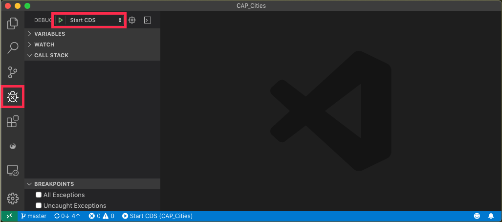
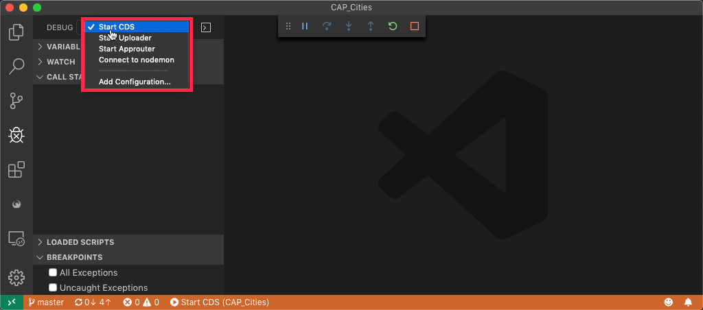
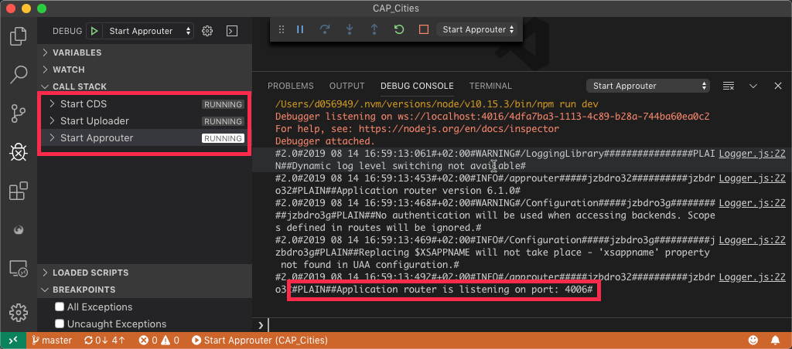
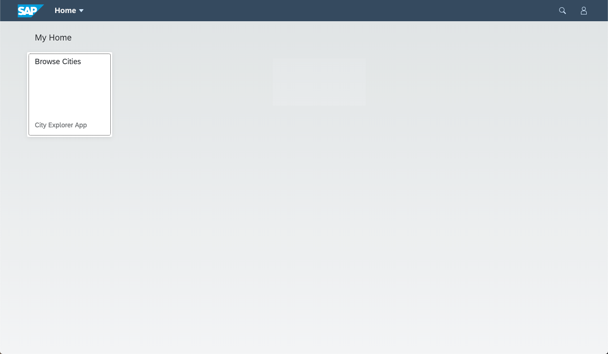
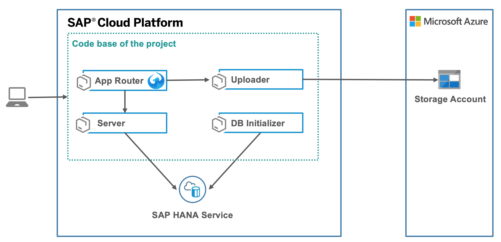

# SAP Cloud Application Programming Model + Azure Blob Storage Sample
[![Build Status][circleci-image]][circleci-url]
[![Dependency Status][daviddm-image]][daviddm-url]


## Description
This is a sample application that can be used as a reference for the SAP Cloud Application Programming Model for SAP Cloud Platform. Besides [CDS](https://help.sap.com/viewer/65de2977205c403bbc107264b8eccf4b/Cloud/en-US/00823f91779d4d42aa29a498e0535cdf.html) tooling, this application contains a [SAP Fiori Elements](https://help.sap.com/viewer/468a97775123488ab3345a0c48cadd8f/7.51.4/en-US/03265b0408e2432c9571d6b3feb6b1fd.html) user interface and an additional microservice which stores images in [Azure blob storage](https://azure.microsoft.com/en-us/services/storage/blobs/).

The application exposes a list of sample entities which represent cities. Each entity contains several properties, like name, region and an image. The user can navigate to a Fiori Object Page and replace the default image with a newly uploaded file. This file will be stored in an Azure storage account and the URL that references the image will then be stored in a table on HANA.


## Requirements

- Install Node.js LTS version 10 from <https://nodejs.org/en/download/>.
- [Create](https://developers.sap.com/tutorials/hcp-create-trial-account.html) an SAP Cloud Platform trial account in the region Europe (Frankfurt)
- [Install](https://developers.sap.com/mission.cp-azure-services.html) the Open Service Broker for Azure in your space.
- [Follow this tutorial](https://developers.sap.com/tutorials/cp-cf-download-cli.html) to install the Cloud Foundry command-line tool.
- Add the Multi-Target Application Cloud Foundry [CLI Plugin](https://github.com/cloudfoundry-incubator/multiapps-cli-plugin).
    ```
    cf add-plugin-repo CF-Community https://plugins.cloudfoundry.org
    cf install-plugin multiapps
    ```
- Install make via a package manager...

    ...for Mac users: This tool should be preinstalled on your machine.

    ...for Windows users (install [chocolatey](https://chocolatey.org/install) first).
    ```
    choco install make
    ```
- Install SQLite3 via a package manager...

    ...for Mac users (install [brew](https://brew.sh/) first).
    ```
    brew install sqlite
    ```

    ...for Windows users (install [chocolatey](https://chocolatey.org/install) first).
    ```
    choco install sqlite
    ```

## Download and Installation
### Cloud Deployment
1. Clone the project.
    ```
    git clone https://github.com/SAP-samples/cloud-foundry-cap-azure-cities
    cd cloud-foundry-cap-azure-cities
    npm install
    ```
2. Build and deploy the project to the cloud.
    ```
    npm run deploy:cf
    ```
3. Wait until the process completed and look for the output line which references the URL of the started app router. Open the displayed URL in a browser.
    

Alternativly, you can also just deploy selected modules and skip services by using [partial deployments](https://blogs.sap.com/2019/12/02/cloudfoundryfun-10-partial-deployments-to-cloud-foundry):

```
cf deploy mta_archives/city-explorer-demo-app.mtar \
    -m city-cap-router \
    -m city-cap-db \
    -m  city-cap-srv \
    -r city-hdi-container​
```


### Local Development
This project consists of several microservices. For local development, each one can be started independently. 
We recommend using VS code as the project comes with support for the VS Code debugger.

1. Clone the project.
    ```
    git clone https://github.com/SAP-samples/cloud-foundry-cap-azure-cities
    cd cloud-foundry-cap-azure-cities
    npm install
    ```
2. Open the project with VS Code.
    ```
    code .
    ```
3. Add a `db/credentials.json` file which contains the credentials for the Azure storage account you want to use. The file should contain the following information.
    ```
    {
        "storageAccountName": "",
        "accessKey": "",
        "primaryBlobServiceEndPoint": "https://<ENDPOINT>.blob.core.windows.net/"
    }
    ```
4. Initialize the SQLite database via `npm run deploy:cds`.
5. Switch to the debugging view and start the first module in debug mode.
    
6. Use the spinner control to switch to see all launch options.
    
7. Launch the following three modules and make sure they are all running.
    -  Start CDS
    -  Start Uploader
    -  Start Approuter
    
    
8. Open <http://localhost:4006> in your browser.

    

## Architecture

The project consists of four modules, as shown in the architecture diagram:



<dl>
  <dt><strong>Database module</strong></dt>
  <dd>A Cloud Foundry tasks that will run once to set up the schema in the HDI container and to import the sample data. Once these steps are completed, the app will shut down and stop consuming memory and CPU quota.</dd>
  <dt><strong>Server module</strong></dt>
  <dd>Connects to the HDI container and exposes the annotated OData service via HTTP</dd>
  <dt><strong>Uploader module</strong></dt>
  <dd>Service to upload files to the Azure storage account that return the URL to access the created resource.</dd>
  <dt><strong>Application router module</strong></dt>
  <dd>The entry point of the application which redirects all incoming traffic to the previous two modules. This module also contains the Fiori Elements user interface.</dd>
</dl>

The [project descriptor file](mta.yaml) also defines the backing services of the project. In this case, the SAP HANA service, for structured data, and an Azure storage account, for unstructured data.

## Known Issues
None so far :)

## How to obtain support
This content is provided "as-is" with no other support.


## License
Copyright (c) 2020 SAP SE or an SAP affiliate company. All rights reserved.
This file is licensed under the SAP Sample Code License except as noted otherwise in the [LICENSE file](LICENSE).

[circleci-image]: https://img.shields.io/circleci/project/github/SAP-samples/cloud-foundry-cap-azure-cities.svg
[circleci-url]: https://circleci.com/gh/SAP-samples/cloud-foundry-cap-azure-cities
[daviddm-image]: https://img.shields.io/david/SAP-samples/cloud-foundry-cap-azure-cities.svg
[daviddm-url]: https://david-dm.org/SAP-samples/cloud-foundry-cap-azure-cities
